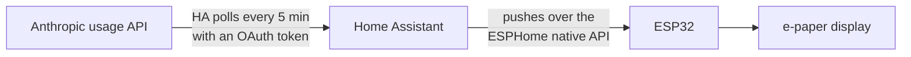

# ESPHome + Home Assistant: Claude Code usage on a 2.9" e-paper display

Your Claude Code usage on a small e-paper panel: session, weekly and per-model
limits, the same numbers `/usage` shows in Claude Code, with the reset time
under each bar. Home Assistant polls the numbers and pushes them to the display,
so it keeps updating with your computer off.

It puts your usage in one place without taking up any screen space, and it
covers everything that counts against your limits: Claude Code on desktop, the
phone app and the web all draw from the same session and weekly caps.

<p>


</p>

## What you get

- Session, weekly and per-model bars, each with its reset time.
- Redraws within a minute of Home Assistant's numbers changing (HA polls the API
  every 5 minutes). It only redraws when something actually changed, so the panel
  isn't flashing all day.
- Keeps working with your computer off, because Home Assistant does the polling.
  Phone and web usage count against the same limits, so the numbers stay right
  either way.
- Any bar at 80% or over flips to white-on-black, so it's readable across the
  room (that's the 85% in the photo).
- It won't show stale or made-up numbers: a full-screen TOKEN EXPIRED banner if
  auth fails, a stale-data note if Home Assistant or the API drops out, and
  dashes rather than a fake zero when a value is missing.
- Renews its own API token every 4 hours, so after setup you don't touch it.

## Hardware

- [FireBeetle 2 ESP32-C6](https://www.dfrobot.com/product-2771.html) (any
  ESP32 that ESPHome supports will do with pin tweaks)
- [Waveshare 2.9" e-Paper Module V2](https://www.waveshare.com/2.9inch-e-paper-module.htm),
  black and white, SPI. Wiring below matches the YAML.
- USB power. (A LiPo works too and battery sensors are included, but 5-minute
  refreshes will drain it; this config assumes mains.)

Wiring as configured: CLK to GPIO4, DIN/MOSI to GPIO6, CS to GPIO7, DC to
GPIO1, BUSY to GPIO3, RST to GPIO2.


The stand is a separate model:
[2.9" ePaper stand for FireBeetle2](https://makerworld.com/en/models/990598-2-9-epaper-stand-firebeetle2-backpack-battery#profileId-966064).

## How it works



Home Assistant polls `https://api.anthropic.com/api/oauth/usage`, the
undocumented endpoint behind Claude Code's own `/usage` screen, and exposes
the numbers as sensors. The ESP subscribes to them over the native API and
draws the bars.

## Setup

### 1. Mint a token

```bash
python3 scripts/mint_claude_token.py
```

Open the printed URL, authorize, paste the code back. The credentials it
saves include a refresh token, which step 4 uses to keep everything renewing
automatically. The script's comments explain the traps that make this
non-obvious (scope requirements, and a User-Agent bot filter that fakes
"rate limited" responses).

### 2. Home Assistant

- Append `homeassistant/rest.yaml` and `homeassistant/helpers.yaml` to your
  `configuration.yaml` (top-level `rest:` and `input_text:` blocks; merge if you
  already have them).
- Restart HA.
- Set the `input_text.claude_oauth_bearer` helper to the `Bearer ...` value the
  mint script printed (Settings > Devices & Services > Helpers, or Developer
  Tools > Actions > `input_text.set_value`). The rest sensor reads this helper
  as its auth header, and the renewal automation keeps it updated, so you never
  reload the integration.
- The sensor polls every 5 minutes, so after pasting the token either wait or
  force it now with Developer Tools > Actions > `homeassistant.update_entity` on
  `sensor.claude_usage_status`.
- Check Developer Tools > States: `sensor.claude_usage_session` and friends
  should be numbers, and `sensor.claude_usage_status` should be `ok`. The other
  states: `auth_failed` = token rejected (re-check the helper value starts with
  `Bearer ` including the space, or re-mint); `unknown` = the request failed or
  the response shape changed; `rate_limited` = temporary API rate limit.

### 3. ESPHome

- Use the `esphome/` dir as your device dir (`firebeetle2-29.yaml` plus
  `includes/text_utils.h`); add `fonts/materialdesignicons-webfont.ttf`
  ([download](https://github.com/Templarian/MaterialDesign-Webfont/raw/master/fonts/materialdesignicons-webfont.ttf))
  as `esphome/fonts/`. Montserrat fetches automatically from Google Fonts at
  build time.
- Install the ESPHome CLI first (`pip install esphome`, or the uv equivalent);
  the first flash is over USB, later updates are OTA.
- Create `esphome/secrets.yaml` with `wifi_ssid`, `wifi_password`,
  `api_encryption_key` (`openssl rand -base64 32`) and `ota_password` (any
  hex string). The YAML pulls all four via `!secret`.
- `cd esphome && esphome run firebeetle2-29.yaml`. HA will auto-discover the
  device (Settings > Devices & Services); add it and paste the
  `api_encryption_key` from `secrets.yaml` when prompted.

### 4. Auto-renewal

Copy `scripts/renew.py` and your minted credentials JSON (as
`credentials.json`) to `/config/claude_usage/` on HA, and add
`shell_command: {claude_usage_renew: "python3 /config/claude_usage/renew.py"}`
to `configuration.yaml`. Restart HA after adding the shell_command (it is not
hot-reloadable). Then append the entries in `homeassistant/automations.yaml` to
`/config/automations.yaml` and reload automations (Developer Tools > YAML), or
recreate them via the UI. To test immediately, run
`shell_command.claude_usage_renew` from Developer Tools > Actions and check the
helper's value changed. From then on HA refreshes the token every 4
hours (and within 10 minutes if it ever fails, e.g. after a long outage),
writes the new one into the helper, and notifies you only if renewal itself
fails (the fix is always the same: run the mint script again). The refresh
token dies after about 30 days unused, so if you skip this step, plan to
re-mint by hand instead.

## Caveat

The usage endpoint is unofficial, so Anthropic could change or break it at any
time. The shape already changed once (mid-2026, when per-model usage moved into
a `limits[]` array). If it changes again the templates fall back to `unknown`
and the panel shows `--`, rather than showing wrong numbers.

If you're adapting it: the per-model row picks the first `weekly_scoped` limit
on your account (rename the label in the display lambda if it's not Fable). For
another board, change `board`/`variant` and the `internal_led` pin, remove the
`external_components` adc override, and delete the FireBeetle-2-C6-specific
battery sensors.

The token and credentials.json grant account access and are included in HA
backups (enable backup encryption); revoke by re-minting if either leaks.

## Similar projects

Inspired by the [TRMNL Claude Usage recipe](https://trmnl.com/recipes/263932)
by Carl Edwards, which scrapes the Claude Code CLI; this build reads the API
directly and runs on cheap standalone hardware.

The endpoint is unofficial but has a real ecosystem:
[ccusage](https://github.com/ryoppippi/ccusage),
[Claude-Code-Usage-Monitor](https://github.com/Maciek-roboblog/Claude-Code-Usage-Monitor)
(whose [issue #202](https://github.com/Maciek-roboblog/Claude-Code-Usage-Monitor/issues/202)
is the best public spec of the endpoint),
[CodexBar](https://github.com/steipete/CodexBar), and, if you'd rather not
hand-roll the HA side, the [hass-claude-usage](https://github.com/trickv/hass-claude-usage)
HACS integration.

Two things in this repo don't seem to be documented anywhere else:

1. **A 1-year token that can read usage.** Public docs treat "long-lived" and
   "usage-capable" as mutually exclusive (`claude setup-token` gives a year
   but inference-only; login tokens can read usage but live for hours).
   Requesting `expires_in: 31536000` at code exchange with only
   `user:profile user:inference` scope gets you both; broad scopes are what
   disqualify custom expiry. The mint script does this. Note you can't keep a
   1-year token and use auto-renewal: refreshing revokes the current access
   token, and refreshed tokens always live about 8 hours. This project uses
   auto-renewal.
2. **The token-endpoint User-Agent trap.** A fake-looking User-Agent gets an
   unconditional, permanent-looking `429 rate_limit_error` from the OAuth
   token endpoint, easily mistaken for real rate limiting (waiting and IP
   changes do nothing). Send the CLI-shaped UA and the same request is
   served. Community docs note a related UA effect on the usage endpoint;
   the token-exchange variant cost us a day of phantom-cooldown chasing.

## LLM Generated, Human Reviewed

This project was generated with Claude Code (Anthropic, Claude Fable 5).
Development was overseen by the human author with attention to reliability
and security. Architectural decisions, configuration choices, and development
sessions were closely planned, directed and verified by the human author
throughout. The code and results were reviewed and tested by the human author
beyond the LLM. Still, the code has had limited manual review; I encourage
you to make your own checks and use this code at your own risk.

## License

PolyForm Noncommercial 1.0.0, see [LICENSE.md](./LICENSE.md).
