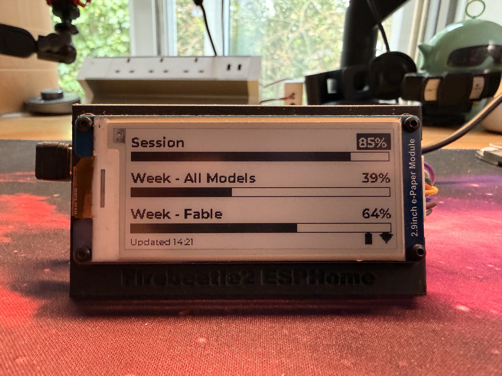
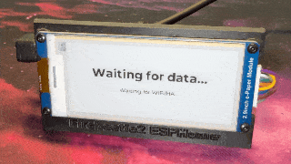
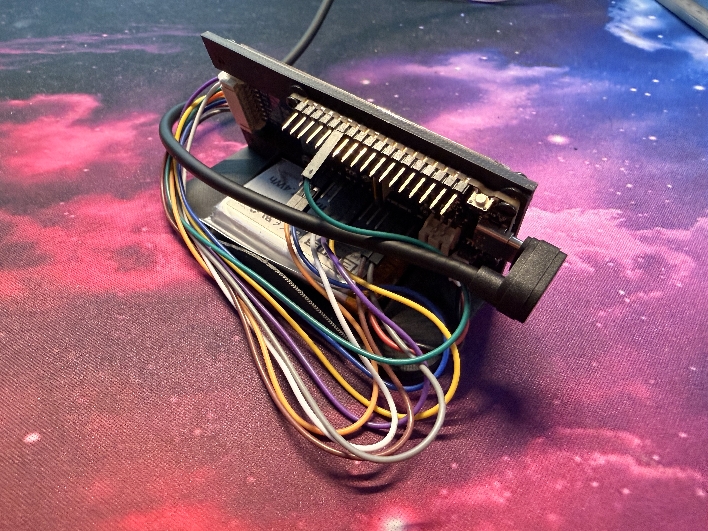

# Claude Code usage on a 2.9" e-paper display

Live Session / Weekly / per-model usage bars for your Claude subscription
(the same numbers as `/usage` in Claude Code), on an always-on e-paper panel.
Updates within a minute of the numbers changing; the panel only refreshes when
something actually changed. Runs entirely off Home Assistant — your computer
can be off.

Extras: reset times per bar, inverted-percentage warning at ≥80%, a full-screen
**TOKEN EXPIRED** banner when auth dies, and stale-data warnings if HA or the
API goes away.

<p>
=80% warning" />

</p>

## Hardware

- [FireBeetle 2 ESP32-C6](https://www.dfrobot.com/product-2771.html) (any ESP32
  ESPHome supports will do with pin tweaks)
- [Waveshare 2.9" e-Paper Module V2](https://www.waveshare.com/2.9inch-e-paper-module.htm),
  B/W, SPI — wiring below matches the YAML
- USB power. (A LiPo works too — battery sensors are included — but 5-min
  refreshes will drain it; this config assumes mains.)

Wiring (as configured): CLK→GPIO4, DIN/MOSI→GPIO6, CS→GPIO7, DC→GPIO1,
BUSY→GPIO3, RST→GPIO2.



The stand is a separate model: [2.9" ePaper stand for FireBeetle2](https://makerworld.com/en/models/990598-2-9-epaper-stand-firebeetle2-backpack-battery#profileId-966064).

## How it works

```
Anthropic usage API  ←(poll 5 min, OAuth token)─  Home Assistant  ─(push)→  ESP32 → e-paper
```

Home Assistant polls `https://api.anthropic.com/api/oauth/usage` — the
**undocumented** endpoint Claude Code's own `/usage` screen uses — and exposes
the numbers as sensors; the ESP subscribes to them over the native API.

## Setup

### 1. Mint a token (one-time, ~2 minutes)

```bash
python3 scripts/mint_claude_token.py
```

Open the printed URL, authorize, paste the code back. This is the **only
manual step, ever**: the credentials it saves include a refresh ticket, and
step 4 makes Home Assistant renew itself every 4 hours from then on. The
script's comments explain the traps that make this non-obvious (scope
requirements, and a User-Agent bot filter that fakes "rate limited"
responses).

(Aside for the curious: the mint itself grants a 1-year access token — see
"Prior art" below, that appears to be novel — but you can't have both that
and auto-renewal: using the refresh ticket revokes the current access token,
and refreshed tokens are always ~8h. Auto-renewal is the better trade: no
annual homework, and a dead panel can't sneak up on you next July.)

### 2. Home Assistant

- Append the contents of `homeassistant/rest.yaml` to your
  `configuration.yaml` (top-level `rest:` block — merge if you already have one).
- Add the `claude_oauth_bearer` line the mint script printed to `secrets.yaml`.
- Restart HA (or reload "RESTful entities and notify services").
- Check Developer Tools → States: `sensor.claude_usage_session` etc. should be
  numbers, `sensor.claude_usage_status` should be `ok`.

### 3. ESPHome

- Use the `esphome/` dir as your device dir (`firebeetle2-29.yaml` + `includes/text_utils.h`); add
  and `fonts/materialdesignicons-webfont.ttf`
  ([download](https://github.com/Templarian/MaterialDesign-Webfont/raw/master/fonts/materialdesignicons-webfont.ttf)) as `esphome/fonts/`.
  Montserrat fetches automatically from Google Fonts at build time.
- In the YAML, set the two `REPLACE_ME` values (API encryption key, OTA
  password) and your `wifi_ssid`/`wifi_password` secrets.
- `cd esphome && esphome run firebeetle2-29.yaml`, then adopt the device in HA.

### 4. Auto-renewal (the part that makes it maintenance-free)

Copy `scripts/renew.py` and your minted credentials JSON to `/config/claude_usage/`
on HA, then wire the `shell_command` + two automations from
`homeassistant/automations.yaml`. From then on HA renews the token every 4 hours,
self-heals after downtime, and notifies you only if renewal fails (the fix
is always: re-run `mint_claude_token.py` once). Note: the refresh ticket
dies after ~30 days unused, so if you skip this step, plan to re-mint
manually instead.

## Notes & gotchas

- **Unofficial API.** Anthropic could change or break this endpoint at any
  time; the JSON shape already changed once (mid-2026: per-model usage moved
  into a `limits[]` array). The HA templates degrade to `unknown` (panel shows
  `--`) rather than lying if the shape shifts again.
- **Rename the model row** if you're not tracking Fable: the template picks the
  first `weekly_scoped` limit for your account, and the label in the display
  lambda is just a string.
- **Don't leave a dead token polling.** Repeated failed-auth polls get the
  usage endpoint itself temporarily 429'd (it forgives as soon as valid auth
  returns). The status sensor + banner exist so a dead token is obvious.
- This Waveshare panel **cannot partial-refresh** under ESPHome
  (`full_update_every: 1` is required or frames superimpose) — that's why the
  config redraws only on data changes instead.
- Battery bits (ADC divider on GPIO0 + the pinned `adc_oneshot` external
  component) are FireBeetle-2-C6-specific — delete both if irrelevant to you.

## Prior art & what's different here

The endpoint is unofficial but has a real ecosystem:
[ccusage](https://github.com/ryoppippi/ccusage),
[Claude-Code-Usage-Monitor](https://github.com/Maciek-roboblog/Claude-Code-Usage-Monitor)
(whose [issue #202](https://github.com/Maciek-roboblog/Claude-Code-Usage-Monitor/issues/202)
is the best public spec of the endpoint),
[CodexBar](https://github.com/steipete/CodexBar), a
[TRMNL recipe](https://trmnl.com/recipes/263932) (which scrapes CLI output
instead of calling the API), and — if you'd rather not hand-roll the HA side —
the [hass-claude-usage](https://github.com/trickv/hass-claude-usage) HACS
integration.

Two things in this repo don't seem to be documented anywhere else:

1. **A 1-year token that can read usage.** Public docs treat "long-lived" and
   "usage-capable" as mutually exclusive (`claude setup-token` = 1 year but
   inference-only; login tokens = usage-capable but hours-lived). Requesting
   `expires_in: 31536000` at code-exchange **with only
   `user:profile user:inference` scope** gets you both — broad scopes are what
   disqualify custom expiry. That's what `mint_claude_token.py` does; no
   refresh machinery needed for a year.
2. **The token-endpoint UA trap.** A fake-looking User-Agent gets an
   unconditional, permanent-looking `429 rate_limit_error` from the OAuth
   token endpoint — trivially mistaken for real rate limiting (waiting and
   IP changes do nothing). Send the CLI-shaped UA and the same request is
   served. (Community docs note a related UA effect on the *usage* endpoint;
   the token-exchange variant cost us a day of phantom-cooldown chasing.)

## Credit

Built with Claude (Fable 5) doing the driving — including discovering the
User-Agent trap the hard way, watching its own token die on the panel it was
debugging, and flashing the fix to the device between messages.
